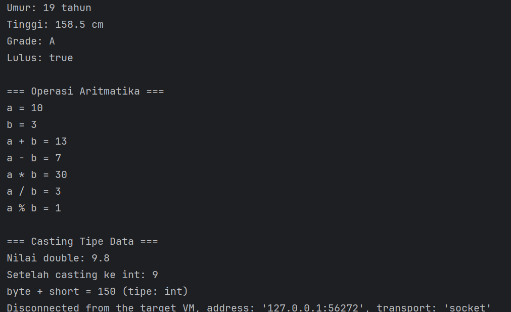
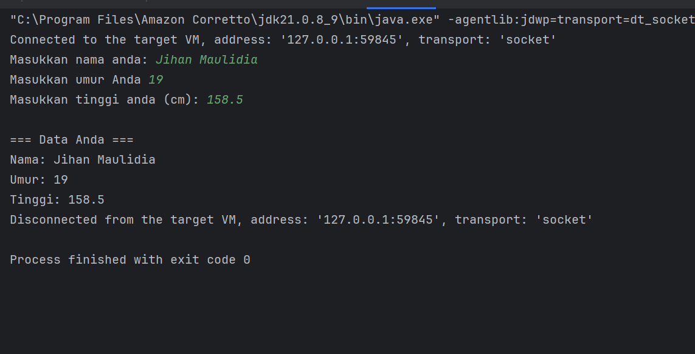
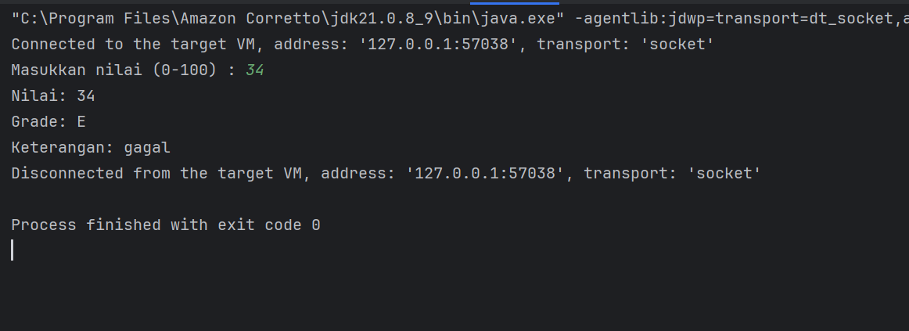
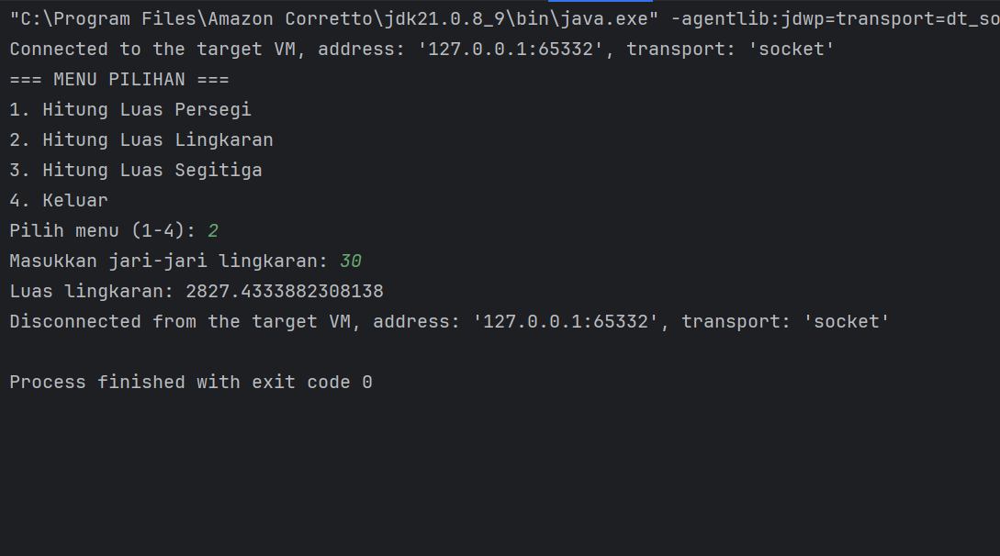
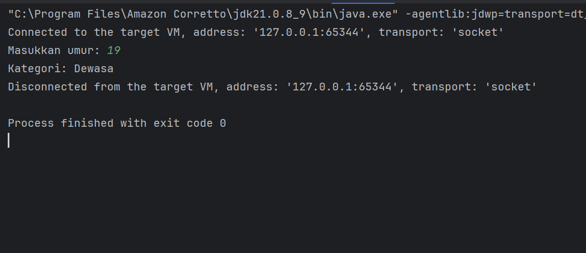
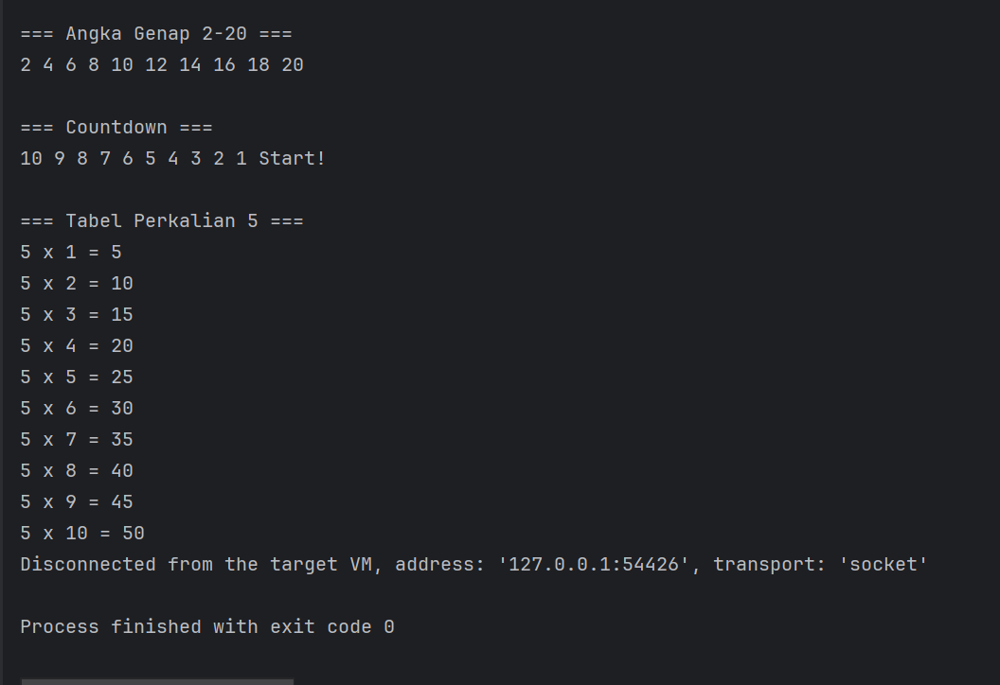
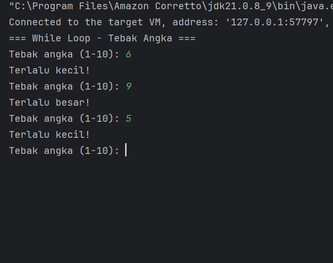
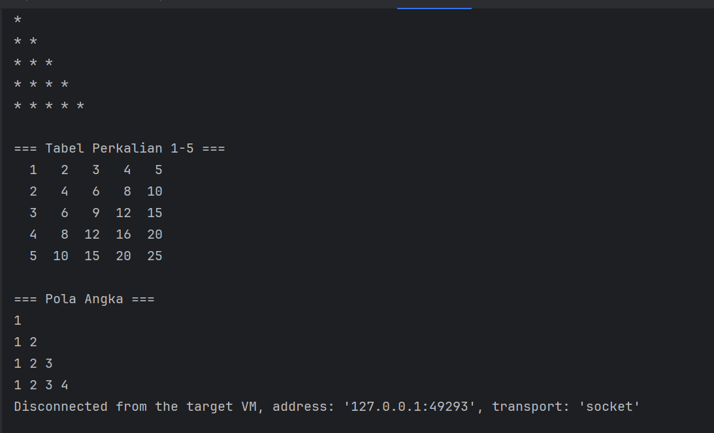

# Laporan Modul 2: Dasar Pemrograman Java
**Mata Kuliah:** Praktikum Pemrograman Berorientasi Objek  
**Nama:** Jihan Maulidia 
**NIM:** 2024573010054 
**Kelas:** TI-2E

## 1. Abstrak
Laporan ini membahas penggunaan struktur perulangan dalam Java
seperti **for loop**, **while loop**, **do-while loop**, dan **nested loop**.  
Tujuan praktikum ini adalah agar mahasiswa paham bagaimana mengimplementasikan  konsep perulangan
dengan maksud mampu meyelesaikan masalah-masalah yang terdapat dalam pemograman .

## 2. Praktikum
### Praktikum 1 - Variabel Demo
#### Dasar Teori
1.Variabel dan Deklarasi Variabel
Variabel adalah nama simbolis untuk lokasi memori yang digunakan untuk menyimpan data. 
Program ini menunjukkan bagaimana sebuah variabel dideklarasikan (tipe data diikuti oleh nama variabel) 
dan diinisialisasi (memberikan nilai awal).
Contoh: int umur = 19;

2.Tipe Data (Data Types)
Tipe Data menentukan jenis nilai yang dapat disimpan oleh suatu variabel
dan operasi apa yang dapat dilakukan padanya. Java memiliki dua kategori utama:
Tipe Data Primitif: Menyimpan nilai sederhana dan langsung di memori. Program ini menggunakan:
int (bilangan bulat)
double (bilangan desimal/pecahan)
char (karakter tunggal)
boolean (nilai kebenaran: true atau false)

Tipe Data Non-Primitif (Referensi): Menyimpan referensi (alamat) ke objek. Program ini menggunakan:
String (deretan karakter)

5.Operasi Aritmatika
Operator Aritmatika digunakan untuk melakukan perhitungan matematis dasar. 
Program ini mendemonstrasikan operator biner:

Penjumlahan (+)
Pengurangan (-)
Perkalian (*)
Pembagian (/): Penting untuk dicatat bahwa pembagian dua integer (a / b) akan menghasilkan hasil integer (integer division),
               membuang sisa hasil bagi (contoh: 10/3=3).
Modulus/Sisa Hasil Bagi (%): Memberikan sisa dari operasi pembagian (contoh: 10%3=1).

4.Konversi Tipe Data (Type Conversion)
Konversi Tipe Data adalah proses mengubah nilai dari satu tipe data ke tipe data lain.
Ada dua jenis yang ditunjukkan:

Casting (Explicit Conversion): Konversi yang dilakukan secara sengaja oleh programmer,
biasanya dari tipe data yang lebih besar (jangkauan nilainya) ke yang lebih kecil. Ini berpotensi menyebabkan hilangnya data (misalnya, bagian desimal hilang saat double dikonversi ke int).

Contoh: int nilaiInt = (int) nilaiDouble;
Automatic Promotion (Implicit Conversion): Konversi otomatis yang dilakukan oleh compiler, biasanya dari tipe data yang lebih kecil ke yang lebih besar. Ini selalu aman dan tidak menyebabkan kehilangan data.
Contoh: byteVar + shortVar akan secara otomatis dipromosikan ke int sebelum penjumlahan, dan hasilnya disimpan dalam int hasil.

6.Input/Output Sederhana
Input/Output (I/O) merujuk pada komunikasi antara program dan dunia luar. Dalam program ini, digunakan Output melalui:
System.out.println(): Ini adalah konsep dasar untuk menampilkan informasi (nilai variabel atau string literal) ke konsol (layar output standar). Tanda \n digunakan untuk membuat baris baru.

### Langkah Praktikum
1. buka aplikasi editor 
2. buat folder ,dimana progra diletakan 
3. buat file baru dengan nama VariabelDemo.java  
4. memastikan nama file diawali huruf besar
5. mengimplementasikan kode kedalam file yang sudah dibuat java
6. jalan kan program untuk melihat hasil akhir

### Screnshoot hasi

### Analisa dan Pembahasan 
Struktur dan Lingkup Program
Program VariabelDemo merupakan implementasi dasar dalam bahasa pemrograman Java. Secara struktural,
program ini terdiri dari satu kelas (VariabelDemo) yang menampung metode utama (public static void main(String[] args)).
Metode utama ini adalah entry point (titik masuk) eksekusi program.
Lingkup program ini terbatas pada demonstrasi konsep-konsep primitif pemrograman, 
yaitu variabel, tipe data, operator aritmatika, dan konversi tipe data.

Program ini dengan jelas membedakan antara kebutuhan penyimpanan data melalui berbagai tipe data.

Tipe Data Primitif vs. Non-Primitif
Program menggunakan empat tipe data primitif dan satu tipe non-primitif:

Primitif: int (untuk umur), double (untuk tinggi), char (untuk grade), dan boolean (untuk status kelulusan). 
Pemilihan tipe ini didasarkan pada kebutuhan memori yang minimal dan representasi nilai tunggal yang efisien.

Non-Primitif: String (untuk nama). String bukanlah tipe primitif; 
ia adalah objek (kelas) yang digunakan untuk menyimpan urutan karakter.

Operator Konkatenasi String
Dalam blok output (System.out.println), operator tambah (+) digunakan untuk menggabungkan string literal 
(teks dalam tanda kutip) dengan nilai variabel. Dalam konteks ini, operator + tidak berfungsi sebagai penambahan 
aritmatika melainkan sebagai operator konkatenasi.

### Praktikum 2 -Input output demo
#### dasar teori
1.Teori Input/Output (I/O) dan Aliran Data
Program ini berakar pada teori Aliran Data (Data Streams) dan interaksi.
 Aplikasi menggunakan dua aliran standar:

 a. Standard Output (System.out): Ini adalah stream data keluar yang digunakan untuk berkomunikasi dengan pengguna, 
    ditampilkan di konsol. Program menggunakan System.out.print() untuk mengirim prompt (permintaan input) kepada pengguna.
b. Standard Input (System.in): Ini adalah stream data masuk, yang mengambil data dari sumber eksternal,
   biasanya keyboard. Objek Scanner menggunakan aliran ini sebagai sumber datanya.

2.Teori Pemrograman Berorientasi Objek (OOP)
Konsep I/O dalam Java sangat bergantung pada OOP, khususnya melalui penggunaan class utilitas:
a. Class dan Objek: Program mengimpor Class java.util.Scanner, yang merupakan blueprint (cetak biru) 
   untuk memecah data input menjadi bagian-bagian yang dapat digunakan.

b. Instansiasi: Baris Scanner input = new Scanner(System.in); adalah implementasi teori Instansiasi.
   Sebuah objek bernama input diciptakan dari class Scanner, dan constructor objek tersebut dihubungkan ke sumber input (System.in). 
   Objek input kini memiliki metode spesifik (nextLine(), nextInt(), nextDouble()) yang memungkinkan pembacaan data dan konversi otomatis
    ke tipe data yang sesuai (String, int, double).

4.Teori Manajemen Sumber Daya
Program ini juga menunjukkan prinsip penting dalam Manajemen Sumber Daya (Resource Management):
Penutupan Sumber Daya: Baris input.close(); adalah praktik esensial yang didasarkan pada teori bahwa setiap sumber daya sistem
 yang dibuka (seperti stream I/O, file, atau koneksi jaringan) harus ditutup (dirilis) setelah selesai digunakan. 
 Kegagalan untuk menutup sumber daya dapat menyebabkan kebocoran sumber daya (resource leak),
  yang dapat menurunkan kinerja atau bahkan menghentikan sistem
  
#### Langkah praktikum
1. buka aplikasi editor 
2. buat folder ,dimana progra diletakan 
3. buat file baru dengan nama InputOutputDemo.java  
4. memastikan nama file diawali huruf besar
5. mengimplementasikan kode kedalam file yang sudah dibuat java
6. jalankan ,untuk melihat hasil

#### Screenshoot hasil

#### Analisa dan pembahasan
1. Instansiasi Objek Scanner:
   Scanner input = new Scanner(System.in);
   Analisis: Ini adalah inti dari OOP. Program membuat objek bernama input dari kelas Scanner dan menghubungkannya ke Standard Input
   (System.in, yaitu keyboard). Objek ini memungkinkan program untuk membaca input.   
    
2. Output Prompt:
   System.out.print("Masukkan nama anda: ");
   Analisis: Menggunakan Standard Output untuk meminta input dari pengguna.
   Penggunaan print() (bukan println()) menjaga kursor tetap di baris yang sama.   
    
3.  Membaca String:
    String nama = input.nextLine();
    Analisis: Menggunakan metode nextLine() untuk membaca seluruh baris teks, termasuk spasi.

4. Membaca Integer:
   int umur = input.nextInt();
   Analisis: Menggunakan nextInt() untuk membaca token berikutnya dan mengonversinya secara otomatis menjadi tipe data int 
   (bilangan bulat).

5. Membaca Double:
   double tinggi = input.nextDouble();
   Analisis: Menggunakan nextDouble() untuk membaca token berikutnya dan mengonversinya menjadi tipe data double (bilangan pecahan). 
   
6. Konkatenasi dan Output:
   System.out.println("Nama: " + nama);
    Analisis: Operator + digunakan sebagai operator konkatenasi untuk menggabungkan string literal ("Nama: ")
    dengan nilai variabel (nama).

7. Manajemen Sumber Daya:
   input.close();
   Analisis: Ini adalah praktik penting. Menutup objek Scanner melepaskan (releases) 
   sumber daya sistem yang digunakan oleh stream input (System.in), mencegah kebocoran sumber daya (resource leak).     

### Praktikum 3 - Grade demo
#### Dasar teori
1. Kontrol Alur Kondisional
    Teori utamanya adalah Eksekusi Kondisional. Program menggunakan struktur 
    if-else if-else untuk mengevaluasi serangkaian ekspresi Boolean (kondisi 
    dengan operator relasional seperti >=) secara berurutan. Kode hanya akan 
    menjalankan satu blok yang kondisinya pertama kali bernilai true, lalu
    melewati sisanya. Ini memungkinkan penetapan grade (A, B, C, D, E) berdasarkan
    rentang nilai secara logis dan eksklusif.

2. Teori I/O dan OOP
   Teori pendukungnya sama dengan program I/O sebelumnya:
   OOP: Penggunaan objek Scanner untuk memfasilitasi pembacaan input dari System.
   in (Instansiasi Objek).

    Manajemen Sumber Daya: Penggunaan input.close() untuk merilis sumber daya 
    sistem, yang merupakan prinsip penting untuk mencegah resource leak.
    
#### Langkah praktikum
1. buka aplikasi editor 
2. buat folder ,dimana progra diletakan 
3. buat file baru dengan nama GradeDemo.java  
4. memastikan nama file diawali huruf besar
5. mengimplementasikan kode kedalam file yang sudah dibuat java
6. jalankan program untuk melihat hasil
 
#### Screenshoot hasil

#### Analisa dan pembahasan 
Program GradeDemo bertujuan menentukan grade dan keterangan berdasarkan input nilai dari pengguna, berfokus pada mekanisme Kontrol Alur dan Pengambilan Keputusan.

1.Inti Logika: if-else if-else
 Fungsi utama program terletak pada struktur if-else if-else bertingkat.
 Ini adalah penerapan teori Eksekusi Kondisional, di mana program menguji
 serangkaian kondisi secara berurutan dan eksklusif:

 Kondisi diuji dari yang tertinggi (nilai >= 85) ke terendah.

 Begitu satu kondisi (misalnya A atau B) terpenuhi (true), blok kode yang sesuai
 akan dijalankan, dan sisa seluruh struktur akan dilewati (short-circuiting).

 Pendekatan ini secara implisit menetapkan rentang nilai yang benar (misalnya,
 grade B hanya diberikan jika nilai ≥75 dan <85).

2.I/O dan Manajemen Sumber Daya
 Program ini menggunakan Objek Scanner untuk mengambil input integer (input.nextInt()). Setelah input diproses dan grade ditetapkan,
 hasilnya ditampilkan menggunakan konkatenasi string. Pentingnya Manajemen Sumber Daya ditekankan oleh baris input.close(), yang merilis stream I/O untuk mencegah kebocoran sumber daya.
 Singkatnya, program ini adalah contoh klasik dari bagaimana kode menggunakan 
 logika kondisional (if-else) untuk memproses input dan menghasilkan output yang 
 berbeda berdasarkan kriteria yang telah ditetapkan.

### Praktikum 4 - Menu demo
#### Dasar teori
1.Percabangan Multikondisional (switch)

Program ini menerapkan teori Eksekusi Terseleksi. Alih-alih menggunakan banyak if-else if,
struktur switch digunakan untuk mengarahkan alur program ke blok kode yang berbeda (case) berdasarkan nilai tunggal 
(pilihan). Ini lebih bersih dan efisien untuk membandingkan variabel dengan nilai diskrit.
    
Pernyataan break: Penggunaan break di setiap case adalah penting secara teori; fungsinya adalah untuk menghentikan
eksekusi blok switch setelah tugas selesai, mencegah kode berjalan terus (fall-through) ke case berikutnya.
    
Kondisi Default: Blok default berfungsi sebagai kondisi catch-all, menangani input yang tidak valid yang tidak sesuai 
dengan case yang ditentukan.

2.Modularitas dan OOP

Modularitas Fungsional: Setiap case mewakili modul fungsi yang terpisah (menghitung luas persegi, lingkaran, dll.),
menunjukkan desain program yang terorganisir.
    
OOP dan I/O: Program menggunakan objek Scanner untuk input (Instansiasi Objek) dan diakhiri dengan input.close() 
sebagai prinsip Manajemen Sumber Daya untuk merilis stream I/O.

#### Langkah praktikum
1. buka aplikasi editor 
2. buat folder ,dimana progra diletakan 
3. buat file baru dengan nama MenuDemo.java  
4. memastikan nama file diawali huruf besar
5. mengimplementasikan kode kedalam file yang sudah dibuat

6. jalankan program untuk melihat hasil

#### Screenshot hasil

#### Analisa dan pembahasan

Program MenuDemo adalah aplikasi konsol sederhana yang menunjukkan penggunaan struktur switch untuk mengelola menu dan mengambil 
keputusan berdasarkan pilihan pengguna.

1. Kontrol Alur Utama: Struktur switch
    Inti program ini adalah struktur switch, yang mengimplementasikan teori Percabangan Multikondisional.
    Mekanisme ini sangat efisien untuk mengarahkan alur program berdasarkan satu variabel input (pilihan) yang  dibandingkan dengan nilai-nilai diskrit (case 1, case 2, dst.):

    Pilihan Terseleksi: Hanya kode di dalam case yang sesuai yang dijalankan.
    Pernyataan break: Penggunaan break setelah setiap case sangat penting secara teori; ini menghentikan eksekusi blok switch dan
    mencegah "fall-through" ke case berikutnya.
    default: Blok default menangani input tidak valid yang tidak cocok dengan case mana pun.

2. Modularitas dan I/O
    Secara desain, setiap case mewakili fungsi yang berbeda (menghitung luas), menunjukkan prinsip Modularitas Fungsional
    dasar. Untuk I/O, program menggunakan objek Scanner (prinsip OOP) untuk mengambil input. Pada perhitungan luas lingkaran,
    program memanfaatkan konstanta Math.PI dari library standar Java.

3. Manajemen Sumber Daya
    Program diakhiri dengan input.close() untuk merilis sumber daya I/O yang digunakan oleh Scanner, memastikan Manajemen 
    Sumber Daya yang tepat. 

### Praktikum 5 - Nested if demo
#### Dasar teori
1. Kontrol Alur: Percabangan Bersarang (Nested If)
    Teori utamanya adalah Pengambilan Keputusan Bertingkat (Multi-level Decision Making).
    Program menggunakan struktur if bersarang (nested if) untuk mengurutkan kondisi:
    
    Validasi Eksternal: if (umur >= 0) berfungsi sebagai lapisan validasi eksternal. 
    Kode di dalam blok bersarang hanya akan dieksekusi jika kondisi terluar ini terpenuhi. Jika umur negatif, alur langsung lompat ke else terluar, menangani data yang tidak valid.
    
    Pengujian Rentang Internal: Blok if-else if-else di dalamnya (bersarang) melakukan pengujian 
    berurutan dan eksklusif untuk menentukan kategori usia. Karena kondisi terluar sudah memastikan umur adalah ≥0, kondisi internal dapat fokus pada batas atas (< 2, < 5, dst.), secara efektif menentukan rentang usia yang tepat.

2. Teori Ekspresi Boolean dan Logika Eksklusif
    Struktur ini mengandalkan evaluasi Ekspresi Boolean (hasil true atau false) menggunakan
    Operator Relasional (>=, <).
    Logika Eksklusif: Sama seperti if-else if-else standar, eksekusi bersifat eksklusif; hanya blok kode yang kondisinya pertama kali bernilai true yang dijalankan. Contohnya, jika umur adalah 15, kondisi < 19 akan true, dan semua kondisi selanjutnya akan dilewati.

3. Teori I/O dan OOP
   Sebagai program interaktif, ia juga mendemonstrasikan teori dasar:

    OOP: Penggunaan objek Scanner untuk mengambil input integer (input.nextInt()) 
    adalah implementasi Instansiasi Objek untuk I/O.
    
    Manajemen Sumber Daya: input.close() di akhir program adalah prinsip penting untuk
    merilis stream I/O dan mencegah resource leak.

#### Langkah praktikum
1. buka aplikasi editor 
2. buat folder ,dimana progra diletakan 
3. buat file baru dengan nama NestedIfDemo.java  
4. memastikan nama file diawali huruf besar
5. mengimplementasikan kode kedalam file yang sudah dibuat java
6. jalankan program untuk melihat hasil

#### Screenshoot hasil

#### Analisa dan pembahasan 
1. Kontrol Alur: Percabangan Bersarang (Nested If)
    Teori utamanya adalah Pengambilan Keputusan Bertingkat (Multi-level Decision Making).
    Program menggunakan struktur if bersarang (nested if) untuk mengurutkan kondisi:
    
    Validasi Eksternal: if (umur >= 0) berfungsi sebagai lapisan validasi eksternal.
    Kode di dalam blok bersarang hanya akan dieksekusi jika kondisi terluar ini terpenuhi. 
    Jika umur negatif, alur langsung lompat ke else terluar, menangani data yang tidak valid.
    
    Pengujian Rentang Internal: Blok if-else if-else di dalamnya (bersarang) melakukan pengujian
    berurutan dan eksklusif untuk menentukan kategori usia. Karena kondisi terluar sudah memastikan umur adalah ≥0, 
    kondisi internal dapat fokus pada batas atas (< 2, < 5, dst.), secara efektif menentukan rentang usia yang tepat.

2. Teori Ekspresi Boolean dan Logika Eksklusif
    Struktur ini mengandalkan evaluasi Ekspresi Boolean (hasil true atau false) menggunakan Operator
    Relasional (>=, <).
    
    Logika Eksklusif: Sama seperti if-else if-else standar, eksekusi bersifat eksklusif; hanya blok kode
    yang kondisinya pertama kali bernilai true yang dijalankan. Contohnya, jika umur adalah 15, kondisi < 19 akan true,
    dan semua kondisi selanjutnya akan dilewati.

3. Teori I/O dan OOP
    Sebagai program interaktif, ia juga mendemonstrasikan teori dasar:
    OOP: Penggunaan objek Scanner untuk mengambil input integer (input.nextInt()) adalah implementasi Instansiasi Objek untuk I/O.
    Manajemen Sumber Daya: input.close() di akhir program adalah prinsip penting untuk merilis stream I/O dan mencegah resource leak.

### Praktikum 6 - For Loop Demo
#### Dasar teori
Teori Perulangan Terstruktur (for Loop)
Teori utamanya adalah Iterasi Terstruktur atau Perulangan Berbasis Penghitung (Counter-Controlled Loop). for loop digunakan ketika jumlah perulangan sudah diketahui atau dapat ditentukan di awal. Struktur perulangan 
for didasarkan pada tiga komponen kunci:
    
Inisialisasi (Initialization): Menetapkan nilai awal untuk variabel kontrol perulangan (misalnya, int i = 1).
Ini hanya dieksekusi sekali di awal.
    
Kondisi (Condition): Ekspresi Boolean yang dievaluasi sebelum setiap iterasi (misalnya, i <= 10).
Jika kondisi ini true, blok kode dijalankan; jika false, perulangan berhenti.
    
Iterasi/Pembaruan (Update/Iteration): Tindakan yang mengubah variabel kontrol perulangan setelah setiap iterasi 
(misalnya, i++ atau i += 2).

1.Jenis dan Arah Iterasi

Program ini menunjukkan bagaimana variabel kontrol (i) dapat dimanipulasi untuk mencapai berbagai pola perulangan:
    
Menghitung Naik (Incrementing): Menggunakan i++ (Contoh 1 & 4) untuk menambah penghitung secara bertahap.
Melompat (Stepping): Menggunakan i += 2 (Contoh 2) untuk melompati nilai, memungkinkan perulangan hanya pada angka genap.
Menghitung Turun (Decrementing/Countdown): Menggunakan i-- (Contoh 3) untuk mengurangi penghitung, membalikkan arah perulangan.

2.Teori Algoritma Pengulangan

Setiap contoh dalam program ini mewakili implementasi algoritma pengulangan untuk tugas spesifik:
    
Pencacahan Sederhana: Menghitung dari 1 ke N.
Pemfilteran Aljabar: Menghitung hanya angka genap dengan memulai dari angka genap dan melangkah dua (i += 2).
Perhitungan Berulang: Menghasilkan tabel perkalian dengan menjalankan operasi (5 * i) di setiap iterasi.
    
Struktur for loop ini menjamin bahwa blok kode akan dieksekusi dalam jumlah waktu yang persis ditentukan oleh kondisi, 
mematuhi teori Kontrol Alur yang terdefinisi.

#### Langkah praktikum
1. buka aplikasi editor 
2. buat folder ,dimana progra diletakan 
3. buat file baru dengan nama ForLOOpDemo.java  
4. memastikan nama file diawali huruf besar
5. mengimplementasikan kode kedalam file yang sudah dibuat

6. jalankan program untuk melihat hasil
#### Screenshoot hasil

#### Analisa dan pembahasan 
Program ForLoopDemo adalah studi kasus untuk mendemonstrasikan Kontrol Alur Program melalui struktur Perulangan for.
Tujuannya adalah menjalankan blok kode berulang kali secara terstruktur dan terhitung.

1. Teori Kontrol Alur: Perulangan for
    Dasar teori utamanya adalah Iterasi Berbasis Penghitung. Struktur for loop sangat ideal karena menggabungkan tiga 
    langkah penting perulangan ke dalam satu baris:

    Inisialisasi (int i = 1): Menetapkan titik awal.
    Kondisi (i <= 10): Menetapkan kriteria berhenti.
    Iterasi/Pembaruan (i++): Mendefinisikan langkah perubahan pada setiap pengulangan.

2. Fleksibilitas Iterasi
    Program ini menunjukkan fleksibilitas dalam memanipulasi variabel kontrol (i) untuk berbagai kebutuhan:
    
    Perhitungan Naik Biasa (i++): Menampilkan angka berurutan (Contoh 1).
    Perhitungan dengan Langkah (Stepping) (i += 2): Melompati nilai untuk hanya menampilkan angka genap (Contoh 2).
    Perhitungan Turun (Countdown) (i--): Membalikkan arah perulangan (Contoh 3).

### Praktikum 7 - While Loop demo
#### Dasar teori
1. Perulangan while (Pre-test Loop)
    Teori: Perulangan ini menerapkan konsep Perulangan Berbasis Kondisi. Blok kode akan terus dieksekusi 
    selama kondisi Boolean bernilai true (while (kondisi)).
    
    Karakteristik Kunci (Pre-test): Kondisi diuji sebelum badan loop dieksekusi. Jika kondisi awal false, kode di dalam
    loop tidak akan pernah dijalankan.

2. Perulangan do-while (Post-test Loop)
    Teori: Perulangan ini menjamin bahwa blok kode akan dieksekusi minimal satu kali, terlepas dari kondisi awalnya.
    
    Karakteristik Kunci (Post-test): Kondisi diuji setelah badan loop selesai dijalankan (while (kondisi) di akhir).
    Ini sangat cocok untuk implementasi menu, di mana pengguna harus melihat menu setidaknya sekali.

3. Kontrol Alur Kondisional & Percabangan
    Program menggunakan percabangan (if-else if-else dan switch) di dalam loop untuk mengubah alur eksekusi berdasarkan
    input pengguna. Logika ini memungkinkan terjadinya pengambilan keputusan yang dinamis di setiap iterasi.

4. Teori I/O dan OOP
    OOP: Program menggunakan Objek Scanner untuk interaksi (input.nextInt()), menerapkan teori Instansiasi Objek untuk
    menangani Input/Output.

    Manajemen Sumber Daya: input.close() memastikan sumber daya sistem dirilis, mencegah resource leak.
    
#### Langkah praktikum
1. buka aplikasi editor 
2. buat folder ,dimana progra diletakan 
3. buat file baru dengan nama WhileLoopDemo.java  
4. memastikan nama file diawali huruf besar
5. mengimplementasikan kode kedalam file yang sudah dibuat

6. jalankan program untuk melihat hasil

#### Screenshoot hasil

#### Analisa dan pembahasan
Perulangan while (Pre-test Loop)
1. Bagian "Tebak Angka" menggunakan loop while.

    Analisis: Ini adalah loop pre-test; kondisi (tebakan != angkaRahasia) diuji sebelum blok kode di dalamnya dijalankan.
    Fungsi  : Sesuai teori, perulangan akan terus berjalan selama tebakan tidak sama dengan angka rahasia. Logika ini efisien 
            untuk skenario di mana jumlah perulangan tidak diketahui dan hanya berakhir ketika kriteria keberhasilan (tebakan benar) tercapai.

2. Perulangan do-while (Post-test Loop)
    Bagian "Menu" menggunakan loop do-while bersama dengan percabangan switch.
    
    Analisis: Ini adalah loop post-test; blok kode (do) dijamin dieksekusi minimal satu kali, dan kondisinya (pilihan != 3) 
              diuji setelah iterasi pertama.
    Fungsi  : Ini ideal untuk menu karena memastikan pengguna melihat opsi menu terlebih dahulu sebelum program menguji apakah 
              mereka memilih opsi keluar (3). Percabangan switch di dalamnya memfasilitasi pengambilan keputusan yang bersih 
              untuk setiap pilihan menu.

### Praktikum 8 - Nested Loop Demo
#### Dasar teori
1. Perulangan Bersarang (Nested Loops)
    Teori: Program menerapkan teori Iterasi Multi-Dimensi. Perulangan bersarang adalah penempatan satu perulangan 
    (inner loop) di dalam badan perulangan lain (outer loop).
    Mekanisme Kunci: Untuk setiap satu kali iterasi pada perulangan luar, perulangan dalam akan menyelesaikan seluruh siklusnya.

2. Kompleksitas Waktu dan Algoritma Iteratif
    Kompleksitas: Perulangan bersarang meningkatkan jumlah total operasi secara signifikan (biasanya N×M atau N 
    2
     ). Misalnya, pada Contoh 2 (Tabel Perkalian), perulangan dijalankan 5×5=25 kali.

    Aplikasi: Perulangan bersarang sangat penting untuk algoritma yang memerlukan pemrosesan data dalam dua dimensi, seperti:
    Matriks: Memproses baris dan kolom (Contoh 2).
    Pola Geometris: Mengontrol baris dan elemen dalam baris (Contoh 1 & 3).

3. Kontrol Variabel Dependen
    Ketergantungan: Pada Contoh 1 dan 3 (Pola Bintang/Angka), jumlah iterasi perulangan dalam (j <= i) bergantung pada nilai 
    variabel perulangan luar (i). Ketergantungan ini memungkinkan pembuatan pola asimetris atau segitiga.

#### Langkah praktikum

1. buka aplikasi editor 
2. buat folder ,dimana progra diletakan 
3. buat file baru dengan nama NestedLoopDemo.java  
4. memastikan nama file diawali huruf besar
5. mengimplementasikan kode kedalam file yang sudah dibuat
6.jalankan proram untuk melihat hasil

#### Screenshoot hasil

#### Analisa dan pembahasan  
Program NestedLoopDemo adalah ilustrasi kunci dari Kontrol Alur Program menggunakan Perulangan Bersarang (Nested Loops).
Struktur ini memungkinkan eksekusi kode yang kompleks dan multidimensi secara terstruktur.

1. Teori Perulangan Bersarang
    Dasar teori utamanya adalah Iterasi Multi-Dimensi. Perulangan bersarang melibatkan satu loop (dalam) yang sepenuhnya
    menyelesaikan seluruh siklusnya untuk setiap satu kali iterasi pada loop luar.

    Mekanisme Kunci: Jika loop luar berulang N kali dan loop dalam berulang M kali, total operasi minimum adalah N×M.
    Aplikasi: Struktur ini sangat penting untuk memproses data dua dimensi (seperti matriks atau tabel, Contoh 2) dan untuk 
    membuat pola geometris (Contoh 1 dan 3) di mana loop luar mengontrol baris dan loop dalam mengontrol kolom atau elemen di 
    dalam baris.

2. Ketergantungan Variabel
    Contoh 1 dan 3 menunjukkan Ketergantungan Variabel yang kuat: jumlah iterasi loop dalam (j <= i) bergantung pada nilai 
    variabel kontrol loop luar (i). Ketergantungan ini yang memungkinkan program menggambar pola segitiga (jumlah elemen per baris 
    meningkat) alih-alih pola persegi.

## kesimpulan
Praktikum ini telah mencakup fondasi utama pemrograman Java, berfokus pada tiga pilar utama: Manajemen Data, Kontrol Alur Program, dan Interaksi I/O.

1. Manajemen Data (Variabel & Tipe Data)
Program VariabelDemo mengajarkan bahwa setiap data harus didefinisikan dengan tipe data yang tepat (int, double, String, dll.). Kami mempelajari cara kerja Operator Aritmatika dan pentingnya Konversi Tipe Data—membedakan antara Casting (berisiko data hilang, e.g., double ke int) dan Automatic Promotion (konversi aman).

2. Kontrol Alur Program (Flow Control)
Bagian terpenting dari praktikum ini adalah menguasai bagaimana alur eksekusi kode dapat diubah:

a. Pengambilan Keputusan (Decision Making): Struktur if-else if-else (GradeDemo, NestedIfDemo) digunakan untuk menguji 
   kondisi Boolean secara berurutan dan eksklusif. Konsep Percabangan Bersarang (Nested If) dipelajari untuk validasi 
   data multi-level (e.g., memeriksa apakah umur valid, lalu mengklasifikasikannya).

b. Percabangan Multikondisional: Struktur switch (MenuDemo) digunakan sebagai alternatif yang efisien untuk if-else if
   ketika memilih aksi berdasarkan nilai diskrit, seperti menu pilihan.

c.  Perulangan (Looping):
    Perulangan Terstruktur (for): Ideal untuk iterasi yang jumlahnya sudah diketahui, seperti countdown atau tabel perkalian (ForLoopDemo).
    Perulangan Berbasis Kondisi (while dan do-while): Digunakan ketika jumlah iterasi tidak pasti dan bergantung pada kondisi (WhileLoopDemo). Perulangan do-while secara khusus menjamin eksekusi minimal satu kali,
    menjadikannya sempurna untuk menu interaktif.
    Perulangan Bersarang (Nested Loop): Penting untuk tugas multidimensi seperti membuat pola atau memproses tabel.

d. Interaksi dan Sumber Daya (I/O)
    Program I/O (InputOutputDemo, dan lainnya) memperkenalkan penggunaan kelas Scanner (prinsip OOP) untuk mengambil input
    dinamis dari pengguna. Kunci dari interaksi ini adalah pemahaman tentang Manajemen Sumber Daya, di mana input.close()
    wajib dilakukan di akhir program untuk merilis stream I/O dan mencegah kebocoran sumber daya (resource leak).

## Rerensi 
1. Kontrol Alur (If-Else, Switch, Nested If)
    Teori tentang pengambilan keputusan dan pengujian kondisi Boolean untuk mengarahkan alur program.
    a. Java if...else Statement & Nested If
        URL: https://www.programiz.com/java-programming/if-else-statement
    
    b. Control Flow Statements (Oracle Official Documentation)
        URL: https://docs.oracle.com/javase/tutorial/java/nutsandbolts/flow.html

2. Perulangan (for, while, do-while, Nested Loop)
    Teori tentang eksekusi kode berulang, termasuk perulangan berbasis penghitung dan berbasis kondisi.

    a. The while and do-while Statements
        URL: https://docs.oracle.com/javase/tutorial/java/nutsandbolts/while.html

    b.The for Statement
       URL: https://docs.oracle.com/javase/tutorial/java/nutsandbolts/for.html

3. Input/Output (I/O) dan Manajemen Sumber Daya
    Teori tentang penggunaan objek (OOP) untuk interaksi dinamis dan pentingnya merilis sumber daya sistem.

    a.Java Scanner Class (Reading Input)
       URL: https://www.programiz.com/java-programming/scanner

    b.Resource Management (Closing Scanner)
    URL: https://labex.io/tutorials/java-how-to-manage-memory-with-scanner-in-java-421856

