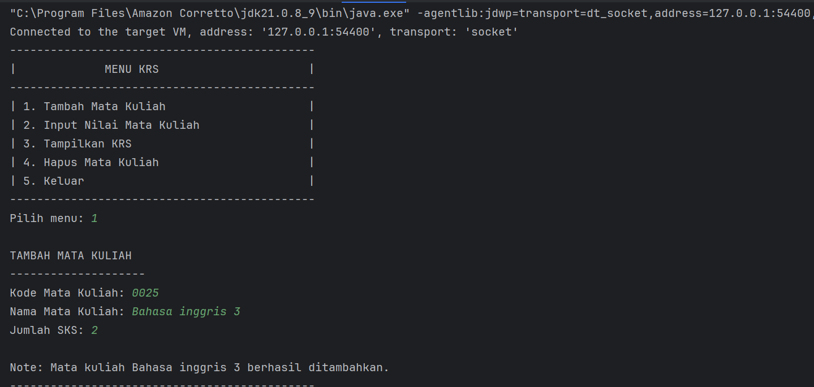
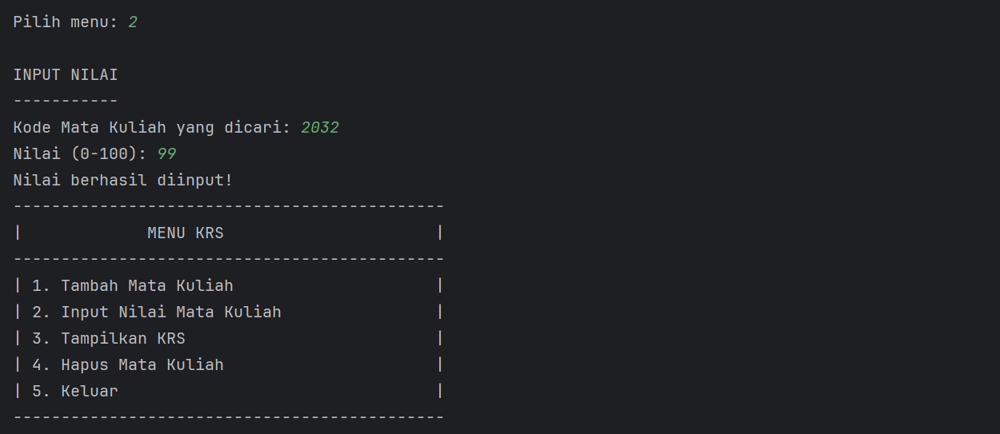
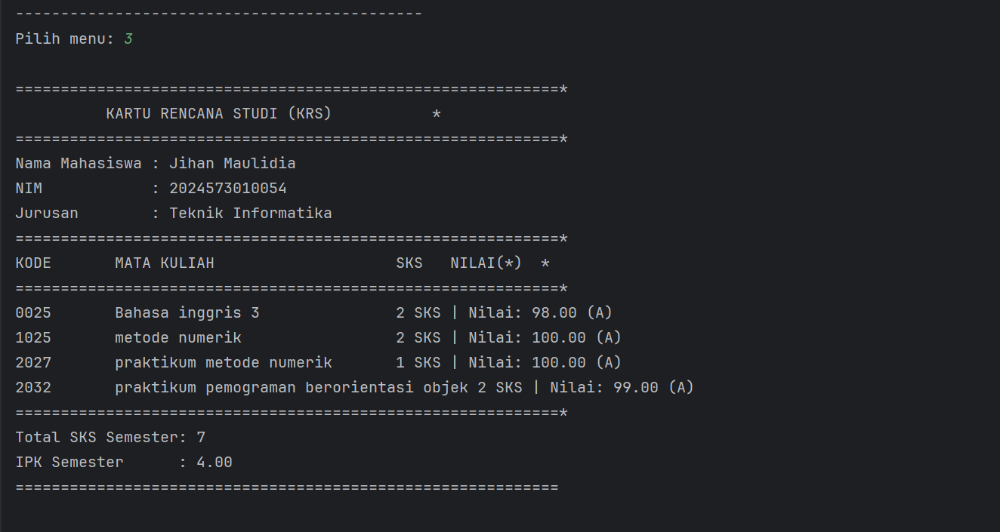
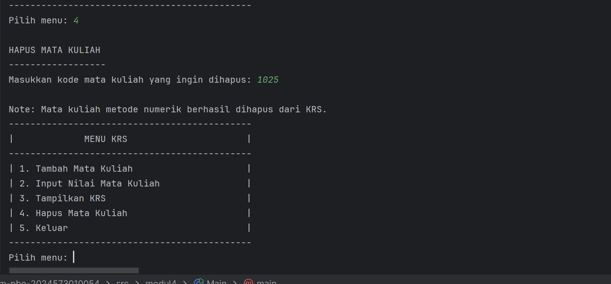
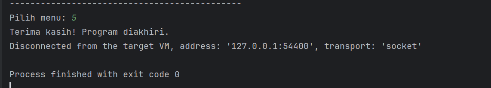
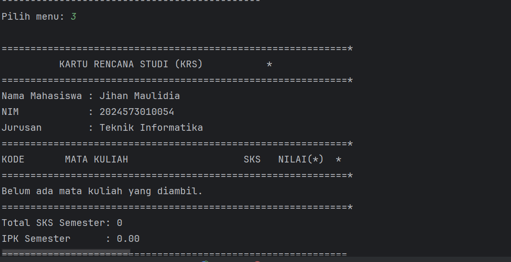

# LAPORAN PRAKTIKUM
## Pengenalan Object Oriented Programming

---

## IDENTITAS MAHASISWA
**Nama**: Jihan Maulidia

**NIM**: 2024573010054

**Kelas**: TI-2E

**MataKuliah**: Praktikum Pemograman Beroerientasi Objek

**Prodi**: Teknik Informatika

**Jurusan**:Teknologi Informasi dan KOmputer

---


## BAB I PENDAHULUAN
### 1.1 Latar Belakang
Sistem informasi akademik merupakan komponen krusial dalam operasional sebuah perguruan tinggi. Salah satu proses fundamental 
dalam sistem ini adalah pengurusan Kartu Rencana Studi (KRS). KRS berfungsi sebagai dokumen resmi yang mencatat mata kuliah 
yang akan diambil mahasiswa dalam satu semester, yang kemudian akan menentukan beban studi dan Indeks Prestasi Kumulatif 
(IPK) mahasiswa.

Praktikum ini bertujuan untuk mensimulasikan proses KRS menggunakan konsep Pemrograman Berorientasi Objek (PBO) pada bahasa
pemrograman Java. Dengan memecah sistem menjadi objek-objek terpisah (Mahasiswa, Matakuliah, dan KartuRencanaStudi), kita 
dapat memahami bagaimana entitas-entitas nyata di dunia akademik dapat dimodelkan, dihubungkan, dan berinteraksi dalam
sebuah program.

### 1.2 Tujuan Praktikum
Tujuan dari pelaksanaan praktikum ini adalah:

- Memahami dan menerapkan konsep PBO, khususnya kelas, objek, atribut, metode, enkapsulasi, dan asosiasi.
- Mampu merancang struktur program yang terorganisir melalui pembagian tanggung jawab antar-kelas (misalnya, Matakuliah 
  bertanggung jawab atas konversi nilai, sementara KartuRencanaStudi bertanggung jawab atas perhitungan IPK).
- Mengimplementasikan fungsionalitas dasar sistem KRS, meliputi penambahan, penghapusan, penginputan nilai, serta validasi 
  total Satuan Kredit Semester (SKS).
- Mengembangkan kemampuan untuk memecahkan masalah kompleks (perhitungan IPK, validasi) menjadi langkah-langkah logis 
  dalam kode.

### 1.3 Permasalahan
Dalam praktikum ini, permasalahan yang diangkat adalah:

- Bagaimana cara memodelkan hubungan antara Mahasiswa, Mata Kuliah, dan KRS menggunakan kelas-kelas PBO?
- Bagaimana menghitung Indeks Prestasi Kumulatif (IPK) semester secara akurat berdasarkan bobot nilai dan SKS?
- Bagaimana menambahkan validasi pada sistem agar total SKS yang diambil tidak melebihi batas maksimal yang ditetapkan 
  (misalnya 24 SKS)?
- Bagaimana mengimplementasikan fitur untuk menghapus mata kuliah dari KRS serta menampilkan analisis nilai terbaik dan 
  terburuk?


## BAB II LANDASAN TEORI

### 2.1 Pemrograman Berorientasi Objek (Object Oriented Programming)

Pemrograman Berorientasi Objek (Object Oriented Programming/OOP) adalah paradigma pemrograman yang berfokus pada objek 
sebagai elemen utama dalam membangun sebuah program. bjek tersebut berisi data (disebut atribut) dan perilaku (disebut 
metode) yang saling berkaitan. onsep OOP memudahkan pengembang dalam membuat program yang modular, mudah dipahami, dan 
mudah dikembangkan kembali. Dengan OOP, setiap bagian dari program dapat direpresentasikan sebagai objek nyata, seperti 
mahasiswa, dosen, atau mata kuliah dalam sistem akademik.

Dalam bahasa pemrograman Java, OOP menjadi dasar utama, sehingga setiap program Java pasti berpusat pada pembuatan dan 
penggunaan kelas (class) serta objek (object).

### 2.2 Konsep Dasar OOP

OOP memiliki empat konsep utama yang menjadi fondasinya, yaitu:

1. Class

Class merupakan template atau cetakan dari suatu objek. Di dalam class terdapat atribut dan metode yang menggambarkan karakteristik serta perilaku dari suatu objek.
Contohnya dalam sistem KRS, terdapat class Mahasiswa, Matakuliah, dan KartuRencanaStudi yang masing-masing mewakili entitas nyata dalam dunia akademik.

```java
public class Mahasiswa {
private String nama;
private String nim;
private String jurusan;
}
```
2. Object

Object adalah instance dari class yang sudah dibuat.
Ketika sebuah class diinstansiasi, maka akan terbentuk objek yang memiliki nilai-nilai nyata untuk atribut di dalamnya.
Misalnya, dari class Mahasiswa, kita dapat membuat objek:

```java
Mahasiswa mhs = new Mahasiswa("Jihan Maulidia", "2024573010054", "Teknik Informatika", 0.0);
```
3. Encapsulation (Enkapsulasi)

Enkapsulasi adalah pembungkusan data dan metode agar tidak dapat diakses secara langsung dari luar class.
Tujuannya untuk menjaga keamanan data (data protection).
Dalam Java, enkapsulasi diterapkan dengan menggunakan modifier seperti private, public, atau protected, serta getter dan
setter untuk mengatur akses data.

Contohnya:

```java
private String nama;

public String getNama() {
return nama;
}

public void setNama(String nama) {
this.nama = nama;
}
```

4. Inheritance (Pewarisan)

Inheritance memungkinkan sebuah class untuk mewarisi atribut dan metode dari class lain.
Dengan pewarisan, kode menjadi lebih efisien dan mudah dikelola.
Sebagai contoh, class MahasiswaAktif bisa mewarisi atribut dari class Mahasiswa tanpa perlu menulis ulang.

public class MahasiswaAktif extends Mahasiswa {
private String statusKRS;
}


5. Polymorphism

Polymorphism berarti “banyak bentuk”, yaitu kemampuan suatu objek untuk memiliki bentuk perilaku yang berbeda tergantung
pada konteksnya. Dalam Java, polymorphism bisa diwujudkan dengan method overriding dan method overloading.

Contoh:

```java
// Overloading
public void tampil(String nama) { }
public void tampil(String nama, int nim) { }

// Overriding
@Override
public void tampilInfo() {
System.out.println("Data Mahasiswa Aktif");
}

```

### 2.3 Class dan Object dalam Program KRS

Dalam praktikum ini, sistem KRS dibangun dengan beberapa class utama, yaitu:

- Class Mahasiswa → menyimpan data mahasiswa seperti nama, NIM, dan jurusan.
- Class Matakuliah → berisi data mata kuliah seperti kode, nama, jumlah SKS, dan nilai.
- Class KartuRencanaStudi → mengelola daftar mata kuliah yang diambil mahasiswa, menghitung total SKS, serta menampilkan IPK.
- Class Main → berfungsi sebagai driver class untuk menjalankan seluruh sistem melalui menu interaktif berbasis konsol.

Setiap class berinteraksi dengan cara membuat objek dan memanggil metode yang saling terhubung, sesuai dengan konsep OOP.

### 2.4 Bahasa Pemrograman Java

Java adalah bahasa pemrograman berorientasi objek yang dikembangkan oleh Sun Microsystems dan kini dimiliki oleh Oracle.
Java terkenal karena sifatnya yang portable (dapat dijalankan di berbagai sistem operasi) dan aman, serta banyak digunakan 
dalam pengembangan aplikasi desktop, web, dan mobile.

- Fitur utama Java meliputi:
- Sintaks yang sederhana dan mirip dengan C/C++.
- Garbage collection otomatis.
- Platform independen melalui konsep “Write Once, Run Anywhere”.
- Mendukung paradigma OOP sepenuhnya.

### 2.5 Struktur Program Java

Setiap program Java minimal memiliki satu class dan satu metode utama (main) yang menjadi titik awal eksekusi.

Contoh:
```java
public class Main {
public static void main(String[] args) {
System.out.println("Hello World!");
}
}
```
## BAB III – IMPLEMENTASI DAN METODOLOGI PRAKTIKUM
### 3.1 Metodologi Praktikum

Metodologi praktikum merupakan langkah-langkah atau tahapan yang dilakukan untuk menyelesaikan tugas praktikum secara
sistematis. Pada praktikum kali ini, metode yang digunakan adalah eksperimen dan analisis kode program berbasis konsep 
Pemrograman Berorientasi Objek (OOP) dengan studi kasus sistem Kartu Rencana Studi (KRS).

Adapun tahapan pelaksanaan praktikum meliputi beberapa langkah berikut:

1. Analisis Kebutuhan Program
Tahap awal dilakukan dengan menganalisis kebutuhan sistem KRS. Sistem ini membutuhkan beberapa entitas utama seperti Mahasiswa, Matakuliah, dan KartuRencanaStudi.
Setiap entitas diimplementasikan dalam bentuk class agar sesuai dengan konsep OOP.

2. Perancangan Class dan Relasi
Pada tahap ini dilakukan perancangan struktur program dengan menggunakan diagram class.

Class Mahasiswa berisi atribut identitas mahasiswa.

Class Matakuliah berisi atribut data mata kuliah seperti kode, nama, dan SKS.

Class KartuRencanaStudi bertanggung jawab untuk mengelola daftar mata kuliah yang diambil oleh mahasiswa.

Class Main menjadi class utama untuk menjalankan program melalui menu interaktif berbasis teks.

3. Implementasi Program
Setelah rancangan disetujui, tahap selanjutnya adalah menuliskan kode program dalam bahasa Java dengan pendekatan modular.
Setiap class disimpan dalam satu file terpisah dan dihubungkan melalui package modul4.

4. Pengujian Program (Testing)
Program diuji dengan memasukkan beberapa data mata kuliah, menampilkan hasil KRS, memberikan nilai, serta menghapus mata kuliah untuk memastikan bahwa seluruh fitur berjalan dengan baik.

5. Evaluasi dan Analisis Hasil
Setelah pengujian dilakukan, hasilnya dianalisis untuk menilai apakah program telah berjalan sesuai dengan konsep OOP dan memenuhi kebutuhan sistem akademik sederhana.
Struktur dasar program Java terdiri dari:

- Deklarasi package dan import library
- Pendefinisian class dan atribut
- Metode utama (main) sebagai eksekusi program


### 3.2 Struktur Program

Struktur program yang digunakan terdiri dari empat class utama yang saling terhubung

| Nama Class          | Deskripsi Singkat                                                                                                    |
| ------------------- | -------------------------------------------------------------------------------------------------------------------- |
| `Mahasiswa`         | Menyimpan data mahasiswa seperti nama, NIM, dan jurusan.                                                             |
| `Matakuliah`        | Menyimpan data mata kuliah seperti kode, nama, jumlah SKS, dan nilai.                                                |
| `KartuRencanaStudi` | Mengelola daftar mata kuliah yang diambil oleh mahasiswa, termasuk menambah, menampilkan, dan <br/>menghapus mata kuliah. |
| `Main`              | Menjadi class utama yang menjalankan program melalui antarmuka berbasis teks (console).                              |


### 3.3 Implementasi Program

Berikut merupakan potongan kode penting dari masing-masing class yang digunakan dalam sistem KRS:

a. Class Mahasiswa

```java
package modul4;

public class Mahasiswa {
private String nama;
private String nim;
private String jurusan;

    public Mahasiswa(String nama, String npm, String jurusan, double ipk) {
        this.nama = nama;
        this.nim = npm; // Menggunakan 'npm' dari parameter untuk mengisi field 'nim'
        this.jurusan = jurusan;
    }

    public String getNama() {
        return nama;
    }

    public String getNim() {
        return nim;
    }

    public String getJurusan() {
        return jurusan;
    }
}
```

b. Class Matakuliah

```java
package modul4;

public class Matakuliah {
    private String kode;
    private String nama;
    private int sks;
    private double nilai;

    public Matakuliah(String kode, String nama, int sks) {
        this.kode = kode;
        this.nama = nama;
        this.sks = sks;
        this.nilai = 0.0;
    }

    // Getters
    public String getKode() { return kode; }
    public String getNama() { return nama; }
    public int getSks() { return sks; }
    public double getNilai() { return nilai; }

    // Setter (dengan validasi)
    public void setNilai(double nilai) {
        if (nilai >= 0.0 && nilai <= 100.0) {
            this.nilai = nilai;
        } else {
            System.out.println("Nilai harus antara 0-100");
        }
    }

    // Metode Konversi: Nilai Angka ke Huruf
    public String getNilaiHuruf() {
        if (nilai >= 85) return "A";
        else if (nilai >= 80) return "A-";
        else if (nilai >= 75) return "B+"; // Baris yang hilang dari potongan Anda
        else if (nilai >= 70) return "B";  // Baris yang hilang dari potongan Anda
        else if (nilai >= 65) return "B-"; // Baris yang hilang dari potongan Anda
        else if (nilai >= 60) return "C+"; // Baris yang hilang dari potongan Anda
        else if (nilai >= 55) return "C";  // Baris yang hilang dari potongan Anda
        else if (nilai >= 50) return "D";
        else return "E";
    }

    // Metode Konversi: Nilai Huruf ke Bobot
    public double getBobotNilai() {
        String huruf = getNilaiHuruf();
        switch (huruf) {
            case "A": return 4.0;
            case "A-": return 3.7;
            case "B+": return 3.3; // Baris yang hilang dari potongan Anda
            case "B": return 3.0;  // Baris yang hilang dari potongan Anda
            case "B-": return 2.7; // Baris yang hilang dari potongan Anda
            case "C+": return 2.3; // Baris yang hilang dari potongan Anda
            case "C": return 2.0;  // Baris yang hilang dari potongan Anda
            case "D": return 1.0;
            default: return 0.0;
        }
    }

    public void tampilkanInfo() {
        // PERHATIAN: Di gambar Anda, formatnya adalah %-10s %-30s %d SKS | Nilai: %.2f (%s)\n
        System.out.printf("%-10s %-30s %d SKS | Nilai: %.2f (%s)\n",
                kode, nama, sks, nilai, getNilaiHuruf());
    }
}
```
c. Class Kartu Rencana Studi

```java
package modul4;

public class KartuRencanaStudi {
    private Mahasiswa mahasiswa;
    private Matakuliah[] daftarMataKuliah;
    private int jumlahMatkul;
    private int maxMatkul;

    public KartuRencanaStudi(Mahasiswa mahasiswa, int maxMatkul) {
        this.mahasiswa = mahasiswa;
        this.maxMatkul = maxMatkul;
        this.daftarMataKuliah = new Matakuliah[maxMatkul];
        this.jumlahMatkul = 0;
    }

    public boolean tambahMatakuliah(Matakuliah matkul) {
        if (jumlahMatkul < maxMatkul) {
            daftarMataKuliah[jumlahMatkul] = matkul;
            jumlahMatkul++;
            System.out.println("\nNote: Mata kuliah " + matkul.getNama() + " berhasil ditambahkan.");
            return true;
        } else {
            System.out.println("\nNote: KRS sudah penuh! Maksimal " + maxMatkul + " mata kuliah.");
            return false;
        }
    }

    // ✅ FITUR BARU: Menghapus mata kuliah dari KRS berdasarkan kode
    public boolean hapusMatakuliah(String kode) {
        for (int i = 0; i < jumlahMatkul; i++) {
            if (daftarMataKuliah[i].getKode().equalsIgnoreCase(kode)) {
                String nama = daftarMataKuliah[i].getNama();

                // Geser elemen setelahnya ke kiri agar tidak ada celah kosong
                for (int j = i; j < jumlahMatkul - 1; j++) {
                    daftarMataKuliah[j] = daftarMataKuliah[j + 1];
                }

                daftarMataKuliah[jumlahMatkul - 1] = null;
                jumlahMatkul--;

                System.out.println("\nNote: Mata kuliah " + nama + " berhasil dihapus dari KRS.");
                return true;
            }
        }

        System.out.println("\nNote: Mata kuliah dengan kode " + kode + " tidak ditemukan di KRS.");
        return false;
    }

    public int hitungTotalSKS() {
        int totalSKS = 0;
        for (int i = 0; i < jumlahMatkul; i++) {
            totalSKS += daftarMataKuliah[i].getSks();
        }
        return totalSKS;
    }

    public double hitungIPK() {
        if (jumlahMatkul == 0) return 0.0;

        double totalBobot = 0.0;
        int totalSKS = 0;

        for (int i = 0; i < jumlahMatkul; i++) {
            Matakuliah mk = daftarMataKuliah[i];
            totalBobot += mk.getBobotNilai() * mk.getSks();
            totalSKS += mk.getSks();
        }

        return totalSKS > 0 ? totalBobot / totalSKS : 0.0;
    }

    public void tampilkanKRS() {
        String separator = "=".repeat(60);

        System.out.println("\n" + separator + "*");
        System.out.println("          KARTU RENCANA STUDI (KRS)           *");
        System.out.println(separator + "*");
        System.out.println("Nama Mahasiswa : " + mahasiswa.getNama());
        System.out.println("NIM            : " + mahasiswa.getNim());
        System.out.println("Jurusan        : " + mahasiswa.getJurusan());
        System.out.println(separator + "*");
        System.out.printf("%-10s %-30s %-5s %-10s%s\n", "KODE", "MATA KULIAH", "SKS", "NILAI(*)", "*");
        System.out.println(separator + "*");

        if (jumlahMatkul == 0) {
            System.out.println("Belum ada mata kuliah yang diambil.");
        } else {
            for (int i = 0; i < jumlahMatkul; i++) {
                daftarMataKuliah[i].tampilkanInfo();
            }
        }

        System.out.println(separator + "*");
        System.out.printf("Total SKS Semester: %d\n", hitungTotalSKS());
        System.out.printf("IPK Semester      : %.2f\n", hitungIPK());
        System.out.println(separator + "\n");
    }

    public Matakuliah cariMatakuliah(String kode) {
        for (int i = 0; i < jumlahMatkul; i++) {
            if (daftarMataKuliah[i].getKode().equalsIgnoreCase(kode)) {
                return daftarMataKuliah[i];
            }
        }
        return null;
    }
}

```
d. class main

```java
package modul4;

import java.util.Scanner;
import java.util.InputMismatchException;

public class Main {
    public static void main(String[] args) {
        Scanner input = new Scanner(System.in);

        // Buat objek Mahasiswa dan KRS
        Mahasiswa mhs = new Mahasiswa("Jihan Maulidia", "2024573010054", "Teknik Informatika", 0.0);
        KartuRencanaStudi krs = new KartuRencanaStudi(mhs, 10);

        boolean running = true;

        while (running) {
            // Tampilan Menu
            System.out.println("---------------------------------------------");
            System.out.println("|             MENU KRS                      |");
            System.out.println("---------------------------------------------");
            System.out.println("| 1. Tambah Mata Kuliah                     |");
            System.out.println("| 2. Input Nilai Mata Kuliah                |");
            System.out.println("| 3. Tampilkan KRS                          |");
            System.out.println("| 4. Hapus Mata Kuliah                      |");
            System.out.println("| 5. Keluar                                 |");
            System.out.println("---------------------------------------------");
            System.out.print("Pilih menu: ");

            int pilihan;
            try {
                if (input.hasNextInt()) {
                    pilihan = input.nextInt();
                    input.nextLine();
                } else {
                    System.out.println("\n! Pilihan tidak valid. Harap masukkan angka menu (1-5).");
                    input.nextLine();
                    continue;
                }
            } catch (InputMismatchException e) {
                System.out.println("\n! Input menu harus berupa angka.");
                input.nextLine();
                continue;
            }

            switch (pilihan) {
                case 1:
                    System.out.println("\nTAMBAH MATA KULIAH");
                    System.out.println("--------------------");

                    System.out.print("Kode Mata Kuliah: ");
                    String kode = input.nextLine();

                    System.out.print("Nama Mata Kuliah: ");
                    String namaMK = input.nextLine();

                    System.out.print("Jumlah SKS: ");
                    if (!input.hasNextInt()) {
                        System.out.println("! Jumlah SKS harus berupa angka.");
                        input.nextLine();
                        break;
                    }
                    int sks = input.nextInt();
                    input.nextLine();

                    Matakuliah mk = new Matakuliah(kode, namaMK, sks);
                    krs.tambahMatakuliah(mk);
                    break;

                case 2:
                    System.out.println("\nINPUT NILAI");
                    System.out.println("-----------");
                    System.out.print("Kode Mata Kuliah yang dicari: ");
                    String kodeCari = input.nextLine();

                    Matakuliah mkCari = krs.cariMatakuliah(kodeCari);

                    if (mkCari != null) {
                        System.out.print("Nilai (0-100): ");
                        if (!input.hasNextDouble()) {
                            System.out.println("! Nilai harus berupa angka.");
                            input.nextLine();
                            break;
                        }
                        double nilai = input.nextDouble();
                        input.nextLine();

                        mkCari.setNilai(nilai);
                        System.out.println("Nilai berhasil diinput!");
                    } else {
                        System.out.println("! Mata kuliah dengan kode '" + kodeCari + "' tidak ditemukan!");
                    }
                    break;

                case 3:
                    krs.tampilkanKRS();
                    break;

                case 4:
                    System.out.println("\nHAPUS MATA KULIAH");
                    System.out.println("------------------");
                    System.out.print("Masukkan kode mata kuliah yang ingin dihapus: ");
                    String kodeHapus = input.nextLine();
                    krs.hapusMatakuliah(kodeHapus);
                    break;

                case 5:
                    System.out.println("Terima kasih! Program diakhiri.");
                    running = false;
                    break;

                default:
                    System.out.println("! Pilihan tidak valid. Silakan pilih 1-5.");
            }
        }
        input.close();
    }
}

```

3.4 Alur Kerja Program

Alur kerja sistem KRS dapat dijelaskan sebagai berikut:

Program dimulai dengan membuat objek Mahasiswa dan KartuRencanaStudi.
Melalui menu interaktif, pengguna dapat:

- Menambahkan mata kuliah baru ke dalam KRS.
- Menginput nilai mata kuliah yang sudah diambil.
- Menampilkan daftar mata kuliah beserta total SKS dan IPK.
- Menghapus mata kuliah tertentu berdasarkan kode.

Setiap tindakan pengguna akan memanggil metode yang sesuai dari class KartuRencanaStudi.

3.5 Pengujian dan Hasil Implementasi


Hasil pengujian menunjukkan bahwa program berjalan dengan baik dan seluruh fitur, termasuk penambahan, penghapusan, dan 
perhitungan IPK, berfungsi sebagaimana mestinya.

| No | Skenario Uji           | Input                                      | Hasil yang Diharapkan                             |
| -- | ---------------------- |--------------------------------------------| ------------------------------------------------- |
| 1  | Menambah mata kuliah   | Kode: 0025, Nama: Bahasa inggris 3, SKS: 2 | Mata kuliah berhasil ditambahkan                  |
| 2  | Menampilkan KRS        | -                                          | Daftar mata kuliah muncul lengkap dengan SKS      |
| 3  | Menginput nilai        | Kode: 0025, Nilai:98                       | Nilai berhasil tersimpan                          |
| 4  | Menghapus mata kuliah  | Kode: 1025                                 | Mata kuliah berhasil dihapus dari daftar          |
| 5  | Menampilkan KRS kosong | -                                          | Pesan “Belum ada mata kuliah yang diambil” muncul |

berikut adalah screenshoot hasil dari pengujian dan implementasi

1. pengujian tambah mata kuliah 


2. pengujian menginput nilaimata kuliah
   

3. pengujian menampilakan krs
   

4. pengujian menghapus mata kuliah
   

5. pengujian keluar dari menu
   

6. pengujian yang menampilkan krs kosong
   


### 3.6 Kesimpulan Implementasi

Dari hasil implementasi dan pengujian yang dilakukan, dapat disimpulkan bahwa:

- Program KRS berhasil menerapkan konsep dasar OOP seperti class, object, encapsulation, dan method interaction.
- Struktur program modular memudahkan pengelolaan serta pengembangan fitur baru, seperti penambahan fungsi hapus mata 
kuliah.
- Sistem berjalan sesuai kebutuhan dan mampu merepresentasikan alur KRS mahasiswa dengan baik.
- Apakah kamu ingin saya bantu lanjutkan sekalian ke Bab IV – Hasil dan Pembahasan, supaya laporanmu nanti nyambung dari hasil implementasi ini ke analisis dan pembahasan fitur programnya?


## BAB IV
### PENUTUP

### 4.1 Kesimpulan
Berdasarkan hasil praktikum yang telah dilakukan, dapat disimpulkan bahwa program **Kartu Rencana Studi (KRS)** berhasil
dibuat dan dijalankan menggunakan bahasa pemrograman Java dengan menerapkan konsep **Pemrograman Berorientasi Objek (PBO)**.

Melalui program ini, mahasiswa dapat melakukan berbagai fungsi penting seperti:
1. Menambahkan mata kuliah ke dalam daftar KRS.
2. Menginput dan menampilkan nilai pada setiap mata kuliah.
3. Menghapus mata kuliah yang tidak diinginkan dari daftar KRS.
4. Menghitung total SKS dan IPK semester secara otomatis.

Dengan adanya fitur-fitur tersebut, program ini membantu memahami bagaimana konsep **class**, **object**, **method**, dan
**encapsulation** diterapkan secara nyata dalam pengembangan aplikasi sederhana. Program ini juga menunjukkan pentingnya 
perancangan struktur kode yang terorganisir agar proses pengembangan dan pemeliharaan menjadi lebih mudah.


### 4.2 Saran
Agar program **Kartu Rencana Studi (KRS)** ini dapat dikembangkan menjadi lebih baik, terdapat beberapa saran yang dapat
dipertimbangkan di masa mendatang, yaitu:
1. Menambahkan fitur penyimpanan data menggunakan file atau database agar data KRS tidak hilang saat program ditutup.
2. Menyediakan fitur **edit data** sehingga pengguna dapat memperbarui nilai atau informasi mata kuliah.
3. Mengembangkan antarmuka **GUI (Graphical User Interface)** menggunakan JavaFX atau Swing agar tampilan program lebih
interaktif dan ramah pengguna.
4. Menambahkan validasi input yang lebih ketat untuk mencegah kesalahan data, seperti pengisian SKS negatif atau nilai di 
luar rentang yang valid.

Dengan pengembangan tersebut, diharapkan program KRS ini dapat menjadi sistem yang lebih lengkap, efisien, dan mudah
digunakan, sekaligus menjadi dasar pembelajaran lanjutan dalam penguasaan konsep PBO dan pengembangan perangkat lunak.

### Daftar Pustaka

[1] Wahana Komputer. (2019). *Pemrograman Java untuk Pemula*. Yogyakarta: Andi Publisher.

[2] Supono, B. (2021). *Dasar-Dasar Pemrograman Berorientasi Objek (OOP) dengan Java*. Jakarta: Elex Media Komputindo.

[3] Oracle. (2023). *Java Platform, Standard Edition Documentation*. Diakses dari https://docs.oracle.com/javase/

