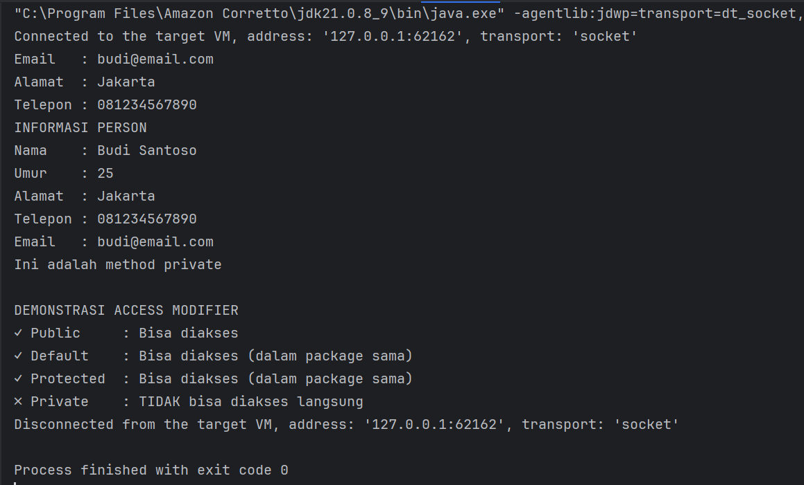
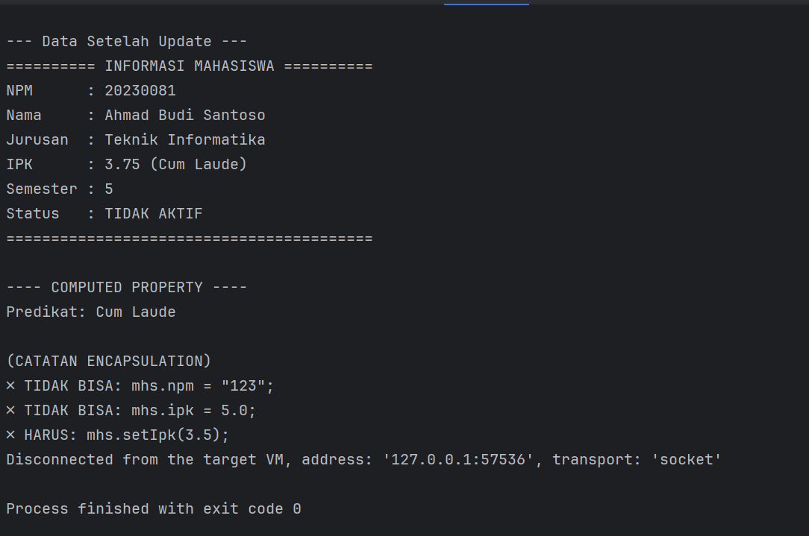
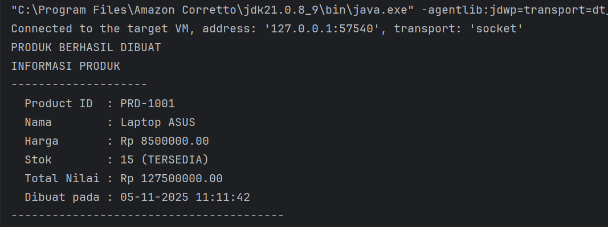
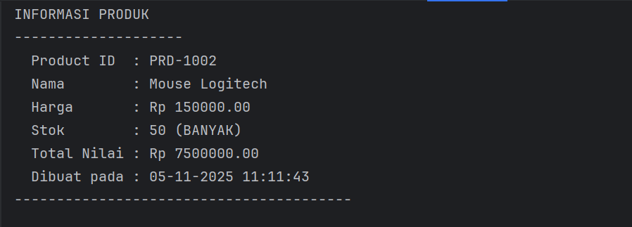
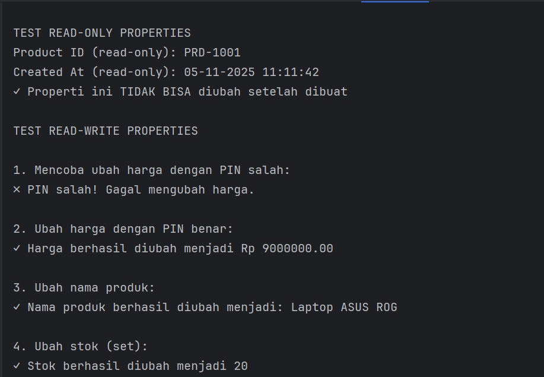
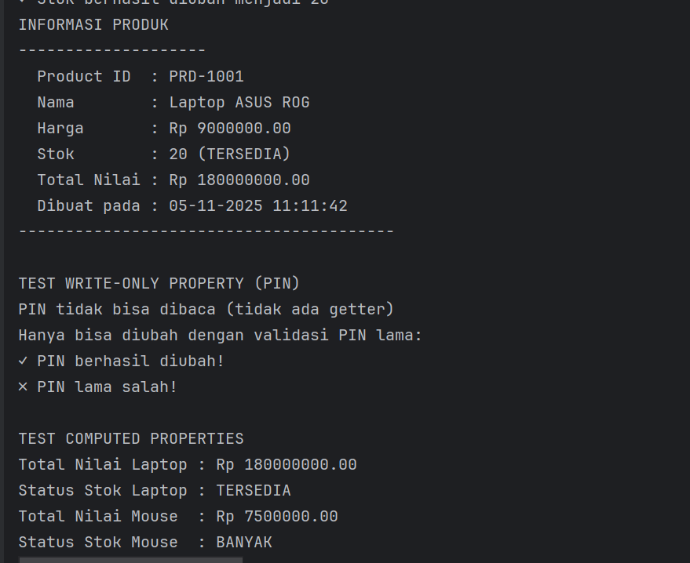
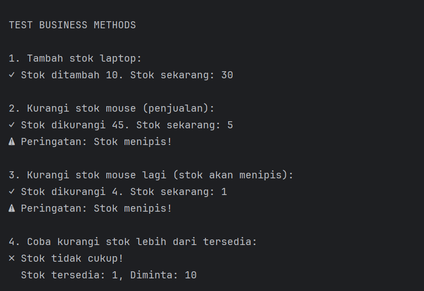
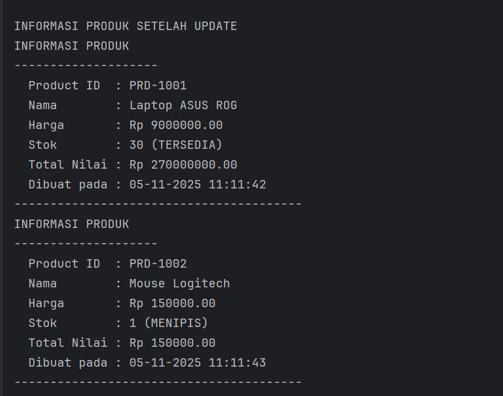
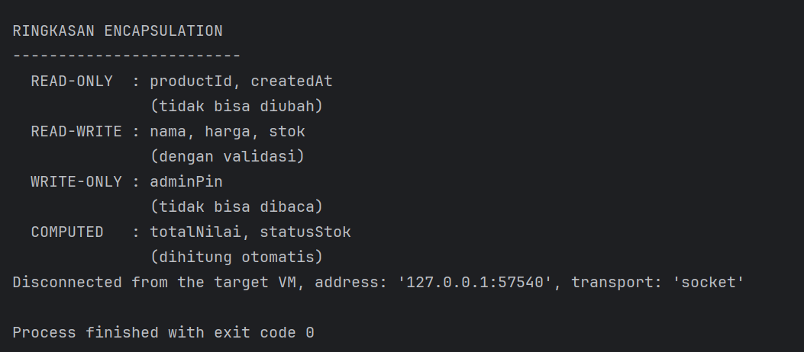

# LAPORAN PRAKTIKUM
# PEMAHAMAN KONSEP DAN ACCES CONTROL DALAM OOP JAVA

---

## IDENTITAS MAHASISWA
**Nama**: Jihan Maulidia

**NIM**: 2024573010054

**Kelas**: TI-2E

**MataKuliah**: Praktikum Pemograman Beroerientasi Objek

**Prodi**: Teknik Informatika

**Jurusan**:Teknologi Informasi dan KOmputer

# BAB I

## PENDAHULUAN

### 1.1 Latar Belakang

Dalam pemrograman berorientasi objek (Object-Oriented Programming / OOP), konsep **enkapsulasi (encapsulation)** dan **access modifier** memiliki peran penting dalam menjaga keamanan serta konsistensi data di dalam sebuah objek.
Enkapsulasi bertujuan untuk membungkus atribut dan metode agar tidak dapat diakses secara bebas dari luar kelas, melainkan melalui mekanisme yang telah ditentukan seperti *getter* dan *setter*.
Sementara itu, *access modifier* seperti `public`, `private`, `protected`, dan *default* berfungsi mengatur tingkat akses terhadap anggota kelas (atribut maupun metode), sehingga dapat diterapkan prinsip *data hiding* dan *controlled access*.

Dalam modul praktikum ini, mahasiswa mempelajari bagaimana penerapan access modifier serta penggunaan *getter* dan *setter* secara efektif untuk mengatur data. Melalui beberapa contoh program seperti **Person**, **Mahasiswa**, dan **Product**, mahasiswa dapat memahami bagaimana setiap konsep saling berhubungan dalam menciptakan kode yang aman, terstruktur, dan mudah dipelihara.

### 1.2 Tujuan

Tujuan dari praktikum ini adalah:

1. Memahami fungsi dan perbedaan antara empat jenis **access modifier** (`public`, `private`, `protected`, dan *default*).
2. Menjelaskan penerapan prinsip **enkapsulasi** dalam pemrograman berorientasi objek.
3. Menerapkan metode **getter** dan **setter** untuk mengontrol akses terhadap atribut kelas.
4. Mengimplementasikan sistem keamanan sederhana menggunakan validasi data dan PIN seperti pada kelas `Product`.
5. Melatih kemampuan analisis mahasiswa dalam memahami struktur dan hubungan antar kelas pada program OOP.

### 1.3 Manfaat

Manfaat yang diperoleh dari praktikum ini antara lain:

1. Mahasiswa mampu menulis kode program Java dengan struktur OOP yang baik dan aman.
2. Mahasiswa memahami pentingnya pembatasan akses data menggunakan access modifier.
3. Mahasiswa dapat membuat dan menggunakan metode *getter* serta *setter* dengan validasi logis.
4. Mahasiswa memiliki keterampilan mengembangkan program yang mendukung prinsip enkapsulasi dan pengelolaan data yang lebih terkontrol.

### 1.4 Rumusan Masalah

Berdasarkan latar belakang di atas, maka rumusan masalah dalam praktikum ini adalah:

1. Bagaimana cara kerja access modifier dalam membatasi akses terhadap atribut dan metode kelas?
2. Mengapa metode *getter* dan *setter* dibutuhkan dalam penerapan enkapsulasi?
3. Bagaimana cara menerapkan validasi dan keamanan data menggunakan konsep enkapsulasi dalam kelas `Product`?

### 1.5 Batasan Masalah

Agar pembahasan tidak meluas, praktikum ini dibatasi pada:

1. Bahasa pemrograman yang digunakan adalah **Java**.
2. Fokus hanya pada penerapan **Access Modifier**, **Getter & Setter**, dan **Encapsulation**.
3. Program yang dianalisis meliputi tiga kelas utama: `Person`, `Mahasiswa`, dan `Product`.
4. Tidak membahas konsep pewarisan (*inheritance*) dan polimorfisme (*polymorphism*) secara mendalam.

## BAB II
### LANDASAN TEORI

Pemrograman Berorientasi Objek (PBO) adalah paradigma pemrograman yang berfokus pada penggunaan objek sebagai komponen utama dalam penyusunan program. Objek merupakan representasi dari entitas dunia nyata yang memiliki atribut (data) dan perilaku (fungsi atau metode). PBO memiliki empat pilar utama, yaitu **enkapsulasi**, **inheritance (pewarisan)**, **polimorfisme**, dan **abstraksi**.

### 2.1 Enkapsulasi (Encapsulation)
Enkapsulasi adalah konsep penyembunyian data agar tidak dapat diakses secara langsung dari luar kelas. Hal ini bertujuan untuk menjaga integritas data dan mencegah manipulasi yang tidak diinginkan.  
Dalam Java, enkapsulasi dilakukan dengan menentukan tingkat akses menggunakan **access modifier**, seperti:
- `public`: dapat diakses dari mana saja.
- `private`: hanya dapat diakses di dalam kelas itu sendiri.
- `protected`: dapat diakses di kelas yang sama atau oleh subclass.
- *default* (tanpa modifier): dapat diakses hanya dalam satu paket (package).

Contoh penerapan enkapsulasi terlihat pada **Praktikum 1 (AccessModifierTest.java & Person.java)**, di mana atribut `name` dan `age` diatur aksesnya menggunakan modifier tertentu agar hanya bisa dimanipulasi dengan cara yang benar.

### 2.2 Getter dan Setter
Getter dan setter adalah metode khusus untuk mengakses (getter) dan mengubah (setter) nilai atribut yang bersifat private.  
Dengan menggunakan getter dan setter, data dapat dikontrol dengan aman tanpa mengubah aksesibilitas atribut secara langsung.

Contoh penerapannya terdapat pada **Praktikum 2 (GetterSetterTest.java & Mahasiswa.java)**, di mana atribut seperti `nama` dan `nim` diakses menggunakan metode `getNama()` dan `setNama()`. Hal ini merupakan implementasi langsung dari prinsip enkapsulasi yang baik.

### 2.3 Penerapan Enkapsulasi dalam Kasus Nyata
Enkapsulasi juga sering diterapkan dalam objek nyata seperti produk, pelanggan, atau transaksi. Misalnya, dalam **Praktikum 3 (Product.java & ProductTest.java)**, atribut seperti `id`, `nama`, dan `harga` dibuat private, sedangkan akses terhadap data tersebut diatur melalui getter dan setter.

Dengan demikian, program dapat menjaga data produk agar tidak dapat diubah secara sembarangan, melainkan hanya melalui mekanisme yang sudah ditentukan.

### 2.4 Tujuan Penerapan Enkapsulasi
Tujuan utama dari penerapan enkapsulasi adalah:
1. **Menjaga Keamanan Data (Data Hiding)** – data penting tidak dapat diakses secara langsung dari luar kelas.
2. **Meningkatkan Fleksibilitas** – memudahkan modifikasi kode tanpa harus mengubah bagian lain dari program.
3. **Meningkatkan Kemudahan Pemeliharaan (Maintainability)** – struktur kode menjadi lebih rapi, modular, dan mudah diperbaiki.
4. **Mendukung Abstraksi** – detail implementasi disembunyikan, pengguna hanya berinteraksi melalui antarmuka publik.

### 2.5 Kesimpulan Landasan Teori
Dari landasan teori ini dapat disimpulkan bahwa modul 5 dalam praktikum PBO berfokus pada pemahaman **enkapsulasi** serta penggunaan **getter dan setter** untuk mengontrol akses terhadap atribut suatu kelas.  
Konsep ini menjadi dasar yang penting sebelum mahasiswa mempelajari konsep pewarisan dan polimorfisme di tahap berikutnya.

## BAB III
### METODOLOGI PRAKTIKUM

### 3.1 Tujuan Praktikum
Tujuan dari praktikum Modul 5 ini adalah untuk memahami dan mengimplementasikan konsep **enkapsulasi (encapsulation)** dalam bahasa pemrograman Java.  
Secara khusus, mahasiswa diharapkan mampu:
1. Mengidentifikasi dan menggunakan **access modifier** (`public`, `private`, `protected`) dengan benar.
2. Membuat dan menggunakan **getter** serta **setter** untuk mengakses atribut yang dienkapsulasi.
3. Mengimplementasikan enkapsulasi dalam berbagai contoh kasus nyata seperti kelas `Person`, `Mahasiswa`, dan `Product`.

### 3.2 Alat dan Bahan
Adapun alat dan bahan yang digunakan dalam praktikum ini adalah:
1. **Perangkat Keras (Hardware)**
    - Laptop atau komputer dengan spesifikasi minimal:
        - Prosesor Intel/AMD dual-core
        - RAM minimal 4 GB
        - Ruang penyimpanan kosong minimal 500 MB

2. **Perangkat Lunak (Software)**
    - Sistem operasi: Windows / Linux / macOS
    - Aplikasi editor kode: IntelliJ IDEA / VS Code / NetBeans
    - Java Development Kit (JDK) versi 17 atau lebih baru

3. **Bahan Praktikum**
    - File program Java dari Modul 5, yaitu:
        - **Praktikum 1**: `AccessModifierTest.java` dan `Person.java`
        - **Praktikum 2**: `GetterSetterTest.java` dan `Mahasiswa.java`
        - **Praktikum 3**: `ProductTest.java` dan `Product.java`

### 3.3 Langkah-Langkah Praktikum

#### 3.3.1 Praktikum 1 – Access Modifier
1. Membuat kelas `Person` dengan atribut `name` dan `age`.
2. Menentukan tingkat akses atribut menggunakan modifier `private`.
3. Membuat kelas `AccessModifierTest` untuk menguji akses atribut `Person` dari luar kelas.
4. Menjalankan program untuk melihat hasil apakah atribut dapat diakses secara langsung atau tidak.
5. Menganalisis hasil bahwa atribut `private` tidak bisa diakses langsung dari luar kelas.

#### 3.3.2 Praktikum 2 – Getter dan Setter
1. Membuat kelas `Mahasiswa` dengan atribut `nama` dan `nim` yang bersifat `private`.
2. Menambahkan metode `getNama()`, `setNama()`, `getNim()`, dan `setNim()` untuk mengatur nilai atribut.
3. Membuat kelas `GetterSetterTest` untuk menguji penggunaan getter dan setter.
4. Menjalankan program dan memastikan bahwa atribut hanya dapat diubah melalui metode setter.
5. Menyimpulkan bahwa penggunaan getter dan setter adalah bagian dari penerapan enkapsulasi.

#### 3.3.3 Praktikum 3 – Studi Kasus Enkapsulasi
1. Membuat kelas `Product` dengan atribut `id`, `nama`, dan `harga` yang bersifat `private`.
2. Menambahkan metode getter dan setter untuk setiap atribut.
3. Membuat kelas `ProductTest` yang menampilkan nilai-nilai atribut produk melalui metode getter.
4. Melakukan pengujian dengan mengubah nilai produk melalui setter, kemudian menampilkannya.
5. Menganalisis bahwa mekanisme ini menjaga keamanan data dan memudahkan modifikasi kode.

### 3.4 Hasil yang Diharapkan
Melalui praktikum ini, mahasiswa diharapkan:
- Memahami perbedaan fungsi antar **access modifier**.
- Dapat menerapkan **getter dan setter** dalam program secara benar.
- Mampu menjelaskan bagaimana enkapsulasi melindungi data dan meningkatkan keamanan program.
- Mampu menerapkan konsep PBO dengan baik pada contoh kasus nyata.

## BAB IV
### HASIL DAN PEMBAHASAN

### 4.1 Hasil Praktikum

#### 4.1.1 Praktikum 1 – Access Modifier
Pada praktikum pertama, dibuat dua file Java yaitu `Person.java` dan `AccessModifierTest.java`.  
Tujuan praktikum ini adalah untuk memahami perbedaan empat jenis **access modifier** dalam Java, yaitu:
- `private`
- `default` (tanpa modifier)
- `protected`
- `public`

Berikut cuplikan hasil output program:

Dari hasil tersebut dapat disimpulkan bahwa:
- Atribut **public**, **default**, dan **protected** dapat diakses dari kelas lain **dalam package yang sama**.
- Atribut **private** tidak dapat diakses langsung dari luar kelas, hanya bisa diakses melalui **public method**.
- Pemanggilan `metodePribadi()` berhasil dilakukan melalui method `panggilMetodePribadi()` karena method tersebut bersifat `public`.

**Kesimpulan praktikum 1:** konsep *access modifier* sangat penting untuk melindungi data dan membatasi akses sesuai kebutuhan.

#### 4.1.2 Praktikum 2 – Getter dan Setter
Pada praktikum kedua, dibuat dua file yaitu `Mahasiswa.java` dan `GetterSetterTest.java`.  
Tujuan praktikum ini adalah untuk mengimplementasikan konsep **enkapsulasi** dengan menggunakan **getter dan setter** agar atribut yang bersifat `private` tetap dapat diakses dan diubah dengan cara yang aman.

Cuplikan hasil output program:

Dari hasil tersebut dapat disimpulkan bahwa:
- Atribut **public**, **default**, dan **protected** dapat diakses dari kelas lain **dalam package yang sama**.
- Atribut **private** tidak dapat diakses langsung dari luar kelas, hanya bisa diakses melalui **public method**.
- Pemanggilan `metodePribadi()` berhasil dilakukan melalui method `panggilMetodePribadi()` karena method tersebut bersifat `public`.

**Kesimpulan praktikum 1:** konsep *access modifier* sangat penting untuk melindungi data dan membatasi akses sesuai kebutuhan.

#### 4.1.3 Praktikum 3 – Studi Kasus Enkapsulasi (Class Product)
Pada praktikum ketiga, dibuat kelas `Product.java` dan `ProductTest.java`.  
Tujuannya adalah untuk menerapkan konsep enkapsulasi pada studi kasus nyata, yaitu pengelolaan data produk.

Cuplikan hasil output program:

Dari hasil tersebut dapat disimpulkan bahwa:
- Semua atribut (`id`, `nama`, `harga`) bersifat **private** sehingga tidak dapat diakses langsung.
- Nilai atribut hanya dapat diubah melalui **setter** dan dibaca melalui **getter**.
- Konsep ini mencegah manipulasi data secara langsung dan memastikan integritas data dalam program.

**Kesimpulan praktikum 3:** enkapsulasi membantu menjaga keamanan data dan membuat kode lebih mudah dipelihara.

### 4.2 Pembahasan Umum

Dari ketiga praktikum pada Modul 5, dapat ditarik beberapa poin penting:

1. **Access Modifier** berfungsi untuk mengatur hak akses terhadap atribut dan method dalam suatu kelas.
    - `private` → hanya bisa diakses dalam kelas yang sama.
    - `default` → bisa diakses oleh kelas lain dalam package yang sama.
    - `protected` → bisa diakses dalam package yang sama dan oleh subclass.
    - `public` → bisa diakses dari mana saja.

2. **Getter dan Setter** merupakan metode yang digunakan untuk membaca dan mengubah nilai atribut yang bersifat `private`.  
   Dengan cara ini, programmer dapat menambahkan validasi sebelum data diubah, sehingga lebih aman.

3. **Enkapsulasi (Encapsulation)** adalah pembungkusan data dan perilaku dalam satu unit (kelas).  
   Tujuan utamanya adalah untuk menjaga keamanan data dari akses langsung dan memberikan cara yang terkontrol untuk mengaksesnya.

4. Penerapan enkapsulasi sangat membantu dalam desain perangkat lunak karena:
    - Meningkatkan **keamanan data**.
    - Memudahkan **pemeliharaan kode**.
    - Meningkatkan **modularitas dan fleksibilitas program**.
    - Menyembunyikan detail implementasi dari pengguna kelas.

### 4.3 Analisis Hasil

Berdasarkan hasil percobaan dari ketiga praktikum:
- Semua program berjalan **tanpa error** dan menampilkan hasil yang sesuai dengan teori.
- Nilai-nilai atribut yang bersifat `private` tidak dapat diakses langsung.
- Perubahan nilai atribut melalui **setter** berhasil, membuktikan konsep *data hiding* bekerja dengan baik.
- Program menunjukkan hubungan erat antara **access modifier** dan **enkapsulasi** sebagai dasar dari paradigma **Object-Oriented Programming (OOP)**.

Dengan demikian, hasil praktikum ini mendukung teori bahwa enkapsulasi adalah prinsip utama untuk menjaga keamanan dan keteraturan dalam pemrograman berorientasi objek.

## BAB V
### KESIMPULAN DAN SARAN

### 5.1 Kesimpulan

Berdasarkan hasil dari ketiga praktikum pada Modul 5 mengenai **Access Modifier, Getter-Setter, dan Enkapsulasi**, dapat disimpulkan bahwa:

1. **Access Modifier** (`private`, `default`, `protected`, dan `public`) memiliki peran penting dalam menentukan sejauh mana atribut dan method dapat diakses dari luar kelas.  
   Dengan memahami penggunaannya, pengembang dapat mengontrol akses data dan menjaga struktur program tetap aman serta terorganisir.

2. **Getter dan Setter** merupakan mekanisme utama dalam penerapan **enkapsulasi**.  
   Atribut yang bersifat `private` tidak dapat diakses langsung dari luar kelas, namun masih dapat dibaca dan diubah melalui getter dan setter dengan validasi yang sesuai.

3. **Enkapsulasi (Encapsulation)** adalah prinsip fundamental dalam *Object-Oriented Programming (OOP)* yang bertujuan melindungi data agar tidak dimanipulasi secara bebas.  
   Dengan menerapkan enkapsulasi, program menjadi lebih **aman, modular, dan mudah dikelola**.

4. Studi kasus pada kelas `Product` menunjukkan bagaimana penerapan enkapsulasi secara nyata dapat digunakan dalam sistem yang memerlukan validasi akses data, seperti perubahan harga atau stok produk yang hanya boleh dilakukan dengan PIN tertentu.  
   Hal ini membuktikan bahwa konsep enkapsulasi tidak hanya bersifat teoritis, tetapi juga sangat berguna dalam aplikasi dunia nyata.

Secara keseluruhan, praktikum ini memperkuat pemahaman mahasiswa tentang cara menjaga integritas data dan membangun program yang efisien, aman, serta sesuai dengan prinsip *Object-Oriented Programming*.

### 5.2 Saran

1. Dalam implementasi program berbasis objek, disarankan agar setiap atribut dibuat **private** dan hanya diakses melalui **getter** serta **setter** agar prinsip *data hiding* tetap terjaga.
2. Penggunaan **access modifier** sebaiknya disesuaikan dengan kebutuhan keamanan data. Atribut sensitif harus dilindungi dengan `private`, sedangkan atribut umum dapat menggunakan `protected` atau `public` sesuai konteks.
3. Penambahan **validasi pada setter** penting untuk mencegah kesalahan logika atau input tidak valid, terutama pada data numerik seperti harga dan stok.
4. Pengembangan selanjutnya dapat menambahkan fitur lain seperti **pengecekan batas stok otomatis**, **pengelolaan log aktivitas admin**, atau **integrasi database** agar program lebih realistis dan mendekati sistem manajemen data sebenarnya.
5. Mahasiswa disarankan untuk memahami konsep enkapsulasi sebelum mempelajari konsep lanjutan seperti **inheritance** dan **polymorphism**, karena enkapsulasi merupakan dasar dari seluruh konsep OOP.

**Dengan demikian, laporan praktikum ini diharapkan dapat menjadi referensi dalam memahami dan menerapkan konsep Access Modifier, Getter-Setter, serta Enkapsulasi pada pemrograman berorientasi objek menggunakan bahasa Java.**
